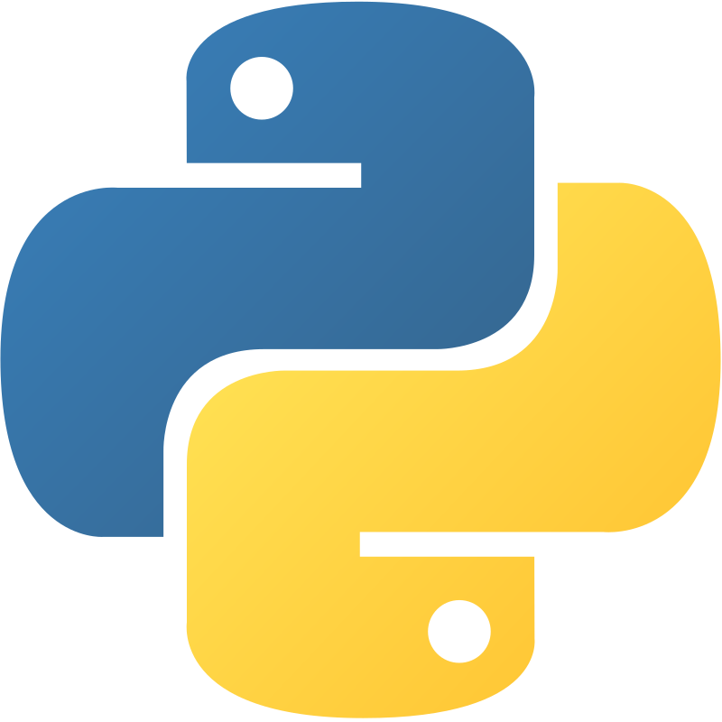
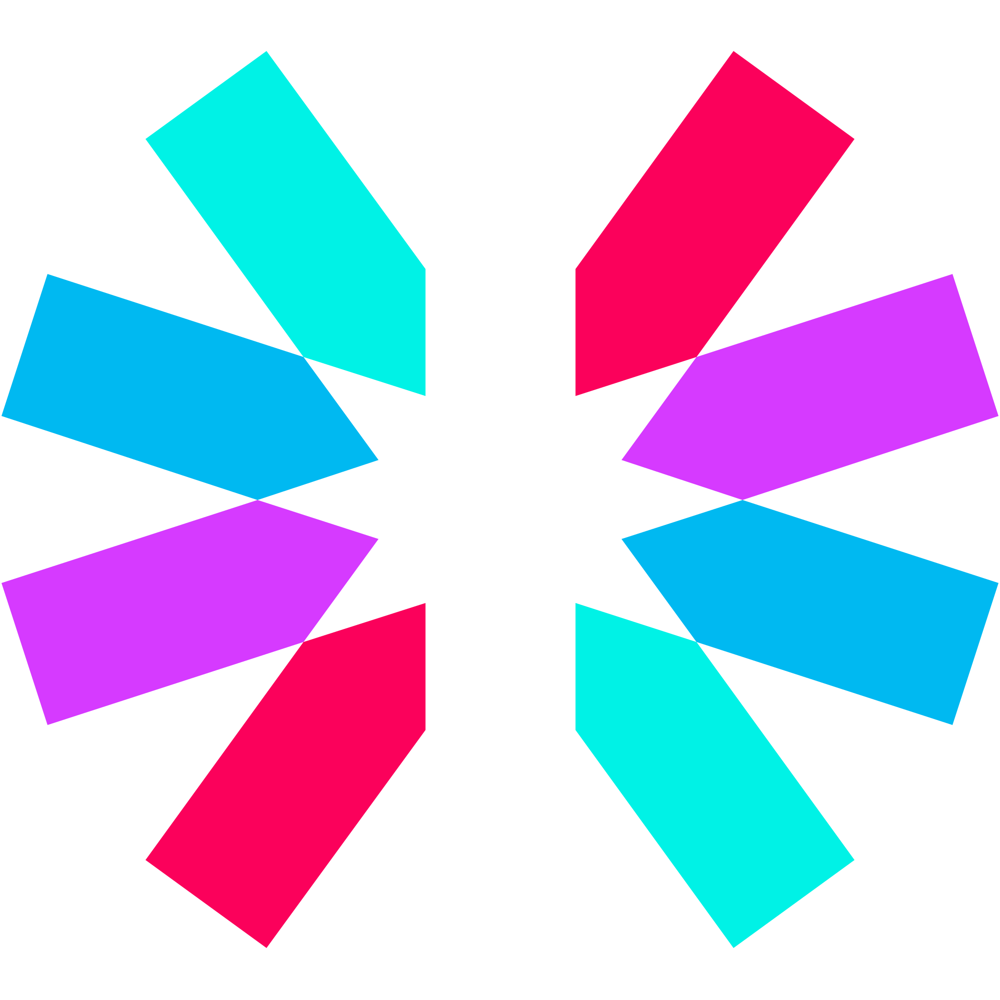
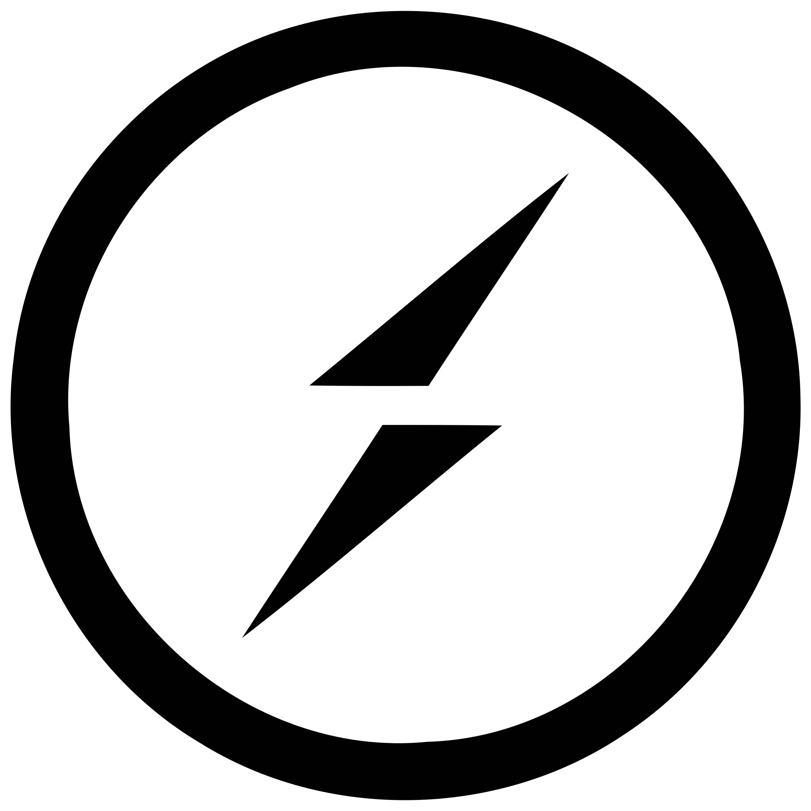
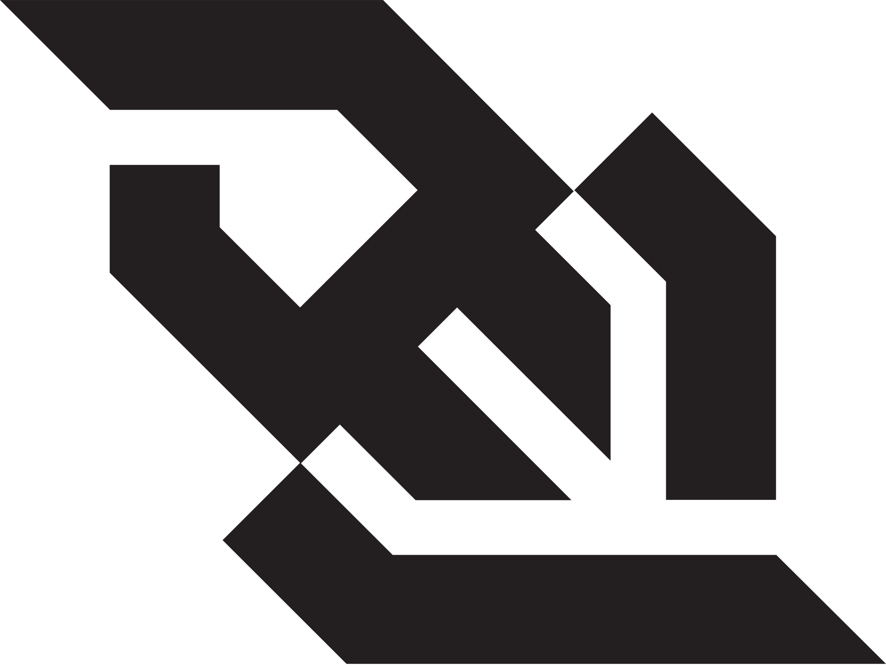
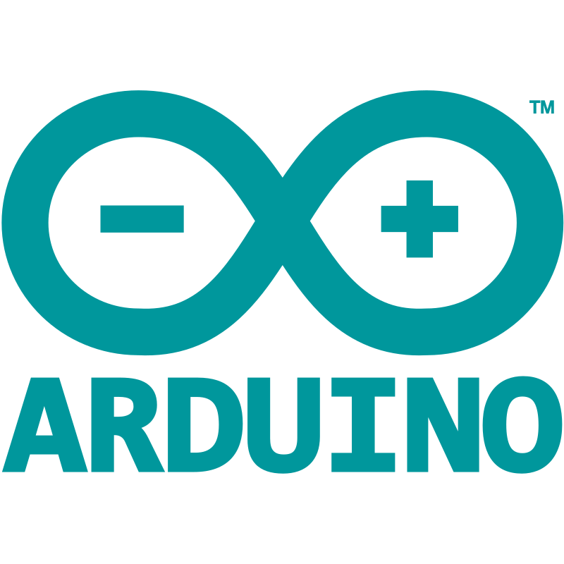

# About Me

```yaml
Name        : Biswasmruti Pradhan
Username    : Rabi22
Role        : Full-Stack Developer

Location    : Balangir, Odisha 🇮🇳

Education   : Bachelor of Technology
              Mechanical Engineering

```

---

# Tech Stack

### Languages

<p align="left">
  
  
  
  
</p>

### Frontend

<p align="left">
  
  
</p>

### Backend

<p align="left">
  
  
  
  
  
  
  
  
  
</p>

### Database

<p align="left">
  
  
</p>

### DevOps & Cloud

<p align="left">
  
</p>

### Embedded & IoT
<p align="left">
  
  
</p>

### Security
<p align="left">
  
  
</p>

### Additional

```text
Microservices Architecture
Multer
VAPT
CVE Analysis
John the Ripper
```

---

# GitHub Analytics

<p align="center">


</p>

<p align="center">


</p>

---

## Contribution Graph

<p align="center">
  <picture>
    <source
      media="(prefers-color-scheme: dark)"
      srcset="https://raw.githubusercontent.com/Rabi22/Rabi22/output/github-contribution-grid-snake-dark.svg">

  <source
      media="(prefers-color-scheme: light)"
      srcset="https://raw.githubusercontent.com/Rabi22/Rabi22/output/github-contribution-grid-snake.svg">

  
  </picture>
</p>

---

# Activity Graph

<p align="center">
  
</p>

---

# 📌 Current Focus

- Building production-grade Full-Stack applications
- Learning Cloud Architecture and ML
- Integrating AI into real-world products
- Optimizing backend performance
- Exploring cybersecurity and DevSecOps

---

# Connect With Me

<p align="left">

<a href="https://www.linkedin.com/in/biswasmruti-pradhan/">

</a>

<a href="https://www.instagram.com/ra_bi2002/">

</a>

<a href="mailto:rabipradhan320@gmail.com">

</a>

</p>

---


# 💡 Quote

> *"Code should solve problems, not create them."*

---
